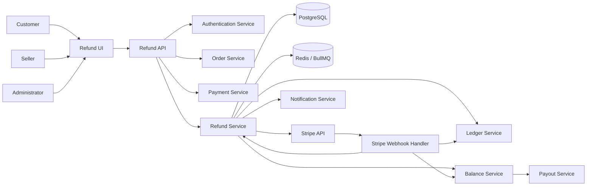
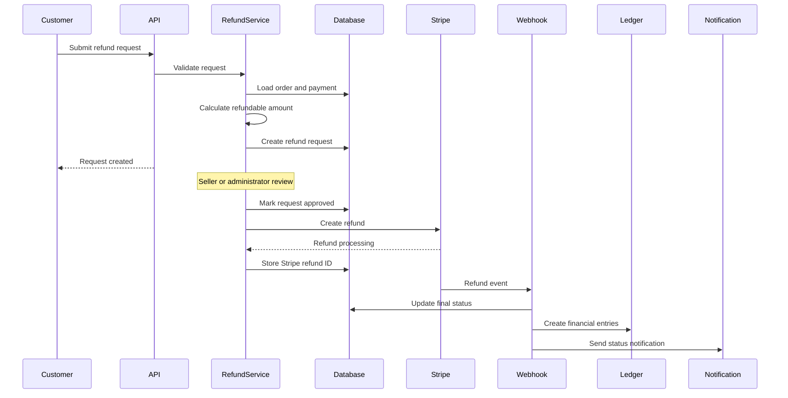
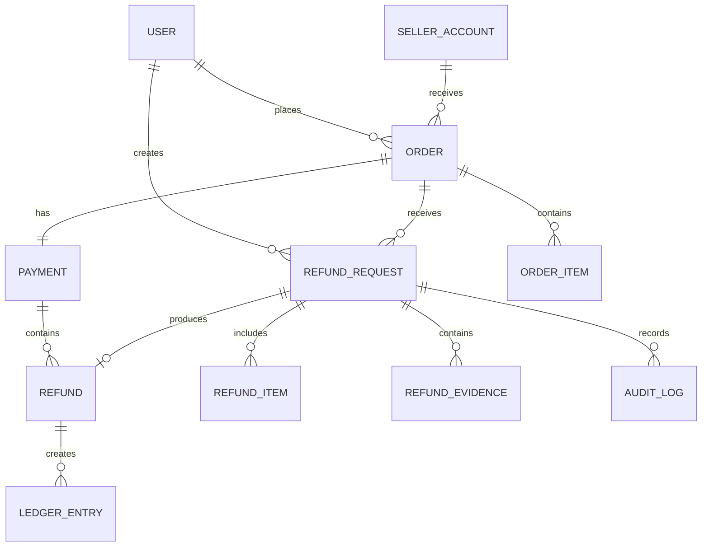
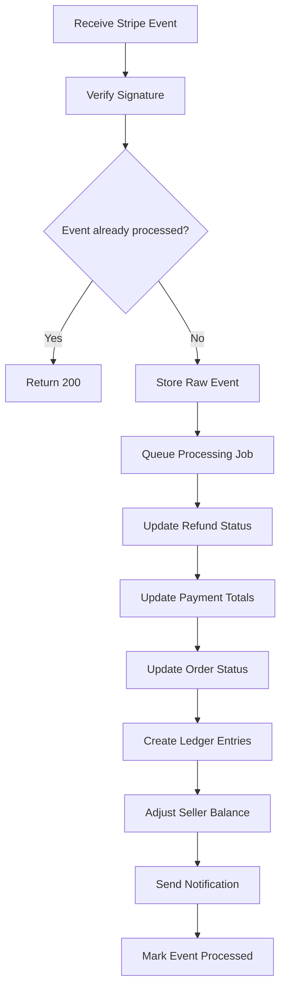

# Refund Management System

> A structured refund module for Checkout and Payout platforms, supporting full refunds, partial refunds, approval workflows, Stripe Connect reversals, balance adjustments, and financial audit trails.

---

## Table of Contents

- [1. Overview](#1-overview)
- [2. Core Features](#2-core-features)
- [3. System Architecture](#3-system-architecture)
- [4. Refund Lifecycle](#4-refund-lifecycle)
- [5. Refund Types](#5-refund-types)
- [6. Business Rules](#6-business-rules)
- [7. Financial Calculation](#7-financial-calculation)
- [8. Data Model](#8-data-model)
- [9. API Design](#9-api-design)
- [10. Stripe Integration](#10-stripe-integration)
- [11. Balance and Payout Protection](#11-balance-and-payout-protection)
- [12. Webhook Processing](#12-webhook-processing)
- [13. Idempotency and Concurrency](#13-idempotency-and-concurrency)
- [14. Failure Handling](#14-failure-handling)
- [15. Security and Audit](#15-security-and-audit)
- [16. Notifications](#16-notifications)
- [17. Project Structure](#17-project-structure)
- [18. Environment Variables](#18-environment-variables)
- [19. Local Development](#19-local-development)
- [20. Testing Strategy](#20-testing-strategy)
- [21. Development Roadmap](#21-development-roadmap)
- [22. Design Principles](#22-design-principles)

---

## 1. Overview

The Refund Management System handles the complete refund process after a successful checkout payment.

It connects the following financial components:

```text
Checkout Payment
      │
      ▼
Refund Request
      │
      ▼
Review and Approval
      │
      ▼
Stripe Refund
      │
      ├── Customer reimbursement
      ├── Seller balance adjustment
      ├── Transfer reversal
      ├── Platform fee adjustment
      └── Ledger reconciliation
      │
      ▼
Payout Protection
```

### Primary Actors

| Actor | Responsibility |
|---|---|
| Customer | Creates and tracks refund requests |
| Seller | Reviews requests related to seller orders |
| Administrator | Reviews, overrides, retries, and audits refunds |
| Refund Service | Validates and processes refund operations |
| Stripe | Processes external payment refunds |
| Ledger Service | Records immutable financial movements |
| Payout Service | Prevents reserved funds from being paid out |

---

## 2. Core Features

### Customer Experience

- Submit refund requests
- Select full or partial refund
- Select affected order items
- Upload supporting evidence
- Cancel eligible requests
- Track refund status
- Receive refund notifications

### Seller Operations

- Review refund requests
- Approve or reject requests
- Review customer evidence
- View balance deductions
- Track transfer reversals
- View refund history

### Administrator Operations

- Review all refund requests
- Override seller decisions
- Create manual refunds
- Retry failed refunds
- Review negative balances
- Inspect Stripe events
- Access audit logs and reconciliation reports

### Financial Controls

- Full and partial refunds
- Multiple partial refunds
- Server-side amount validation
- Seller balance reservation
- Stripe Connect transfer reversal
- Platform fee adjustment
- Immutable ledger entries
- Duplicate refund prevention
- Payout protection
- Negative balance recovery

---

## 3. System Architecture

### 3.1 High-Level Architecture



### 3.2 Architecture Layers

```text
Presentation Layer
├── Customer Refund Form
├── Refund Details Page
├── Refund Status Timeline
├── Seller Refund Dashboard
└── Admin Refund Dashboard

Application Layer
├── Refund Request Use Cases
├── Review and Approval Use Cases
├── Refund Execution Use Cases
├── Retry and Recovery Use Cases
└── Notification Use Cases

Domain Layer
├── Refund Eligibility Rules
├── Refund Amount Rules
├── Refund State Machine
├── Balance Reservation Rules
└── Ledger Posting Rules

Infrastructure Layer
├── PostgreSQL
├── Prisma ORM
├── Redis
├── BullMQ Workers
├── Stripe API
├── Object Storage
├── Email Provider
└── Logging and Monitoring
```

### 3.3 Recommended Technology Stack

| Layer | Recommended Technology |
|---|---|
| Frontend | Next.js, React, TypeScript, Tailwind CSS |
| Backend | Node.js, TypeScript, NestJS or Express |
| Database | PostgreSQL |
| ORM | Prisma |
| Queue | Redis and BullMQ |
| Payment Provider | Stripe |
| File Storage | Amazon S3 or compatible storage |
| Validation | Zod or class-validator |
| Testing | Vitest or Jest, Supertest, Playwright |
| Monitoring | OpenTelemetry, Sentry, structured logs |

---

## 4. Refund Lifecycle

### 4.1 Main Processing Flow



### 4.2 Refund Request Statuses

| Status | Meaning |
|---|---|
| `requested` | Customer submitted the request |
| `under_review` | Seller or administrator is reviewing |
| `approved` | Request is approved for processing |
| `processing` | Refund was submitted to Stripe |
| `succeeded` | Stripe confirmed the refund |
| `failed` | Refund processing failed |
| `rejected` | Reviewer rejected the request |
| `cancelled` | Request was cancelled before processing |
| `requires_action` | Manual intervention is required |

### 4.3 Recommended State Transitions

```text
requested
├── under_review
├── cancelled
└── rejected

under_review
├── approved
├── rejected
└── cancelled

approved
├── processing
└── failed

processing
├── succeeded
├── failed
└── requires_action

failed
├── processing
├── requires_action
└── cancelled
```

### 4.4 Order Status Synchronization

| Refund Result | Order Status |
|---|---|
| No successful refund | `paid` |
| Refunded amount is lower than payment amount | `partially_refunded` |
| Refunded amount equals payment amount | `refunded` |

---

## 5. Refund Types

### 5.1 Full Refund

Returns the complete refundable payment amount.

```text
Original payment: $100.00
Refund amount:    $100.00
Remaining amount:   $0.00
```

### 5.2 Partial Refund

Returns only part of the original payment.

```text
Original payment: $100.00
Refund amount:     $30.00
Remaining amount:  $70.00
```

### 5.3 Multiple Partial Refunds

Allows several partial refunds until the refundable balance reaches zero.

```text
Original payment: $100.00
First refund:      $20.00
Second refund:     $30.00
Remaining amount:  $50.00
```

### 5.4 Item-Level Refund

A refund can be linked to individual order items and quantities.

```text
Order Item A
├── Purchased quantity: 3
├── Refunded quantity:  1
└── Remaining quantity: 2
```

---

## 6. Business Rules

### 6.1 Refund Eligibility

A refund request is eligible only when:

- The order exists
- The order belongs to the requester
- The payment completed successfully
- The requested amount is greater than zero
- The requested amount does not exceed the refundable amount
- The payment has not already been fully refunded
- The request is within the configured refund window
- The currency matches the original payment currency
- The request does not duplicate an active refund
- The order is not blocked by an unresolved dispute
- The selected item quantities are valid

### 6.2 Refund Reasons

| Code | Description |
|---|---|
| `duplicate` | Customer was charged more than once |
| `fraudulent` | Payment is suspected to be fraudulent |
| `requested_by_customer` | General customer request |
| `product_not_received` | Customer did not receive the product |
| `product_damaged` | Product arrived damaged |
| `incorrect_product` | Wrong product was delivered |
| `service_not_provided` | Purchased service was not delivered |
| `order_cancelled` | Order was cancelled |
| `billing_error` | Incorrect amount or billing information |
| `other` | Reason requires a custom description |

### 6.3 Review Rules

- Customers cannot approve their own requests
- Sellers can review only their own orders
- Administrators can review all requests
- Approved amounts must be recalculated by the backend
- A rejected request must contain a review reason
- A processed refund cannot be cancelled
- Manual overrides must be recorded in the audit log

---

## 7. Financial Calculation

### 7.1 Refundable Amount

```text
Refundable Amount
=
Original Captured Amount
- Successful Refund Amount
- Active Processing Refund Amount
```

Example:

```text
Original payment:          $150.00
Successful refunds:         $40.00
Processing refunds:         $20.00
Maximum refundable amount:  $90.00
```

### 7.2 Integer Money Storage

All monetary values must be stored in the smallest currency unit.

```text
$10.00 = 1000 cents
$49.99 = 4999 cents
```

Recommended type:

```ts
type Money = {
  amount: number;
  currency: "usd";
};
```

For very large values, use `bigint` or a decimal-safe database type.

### 7.3 Payout-Eligible Balance

```text
Payout-Eligible Balance
=
Available Seller Balance
- Pending Refund Reserve
- Approved Refund Reserve
- Dispute Reserve
- Platform Risk Reserve
```

Example:

```text
Available seller balance: $1,000.00
Pending refund reserve:     $150.00
Dispute reserve:              $50.00
Risk reserve:                $100.00
Payout-eligible balance:     $700.00
```

---

## 8. Data Model

### 8.1 Entity Relationship



### 8.2 `RefundRequest`

```text
id
orderId
paymentId
customerId
sellerId
requestedBy
requestedAmount
approvedAmount
currency
reason
description
status
reviewedBy
reviewNote
reviewedAt
approvedAt
rejectedAt
cancelledAt
createdAt
updatedAt
```

### 8.3 `Refund`

```text
id
refundRequestId
orderId
paymentId
stripeRefundId
amount
currency
status
reason
failureCode
failureReason
idempotencyKey
processedAt
succeededAt
failedAt
createdAt
updatedAt
```

### 8.4 `RefundItem`

```text
id
refundRequestId
orderItemId
quantity
unitAmount
refundAmount
createdAt
updatedAt
```

### 8.5 `RefundEvidence`

```text
id
refundRequestId
fileUrl
fileKey
fileType
fileSize
description
uploadedBy
createdAt
```

### 8.6 `LedgerEntry`

```text
id
sellerId
orderId
paymentId
refundId
payoutId
type
amount
currency
balanceAfter
reference
metadata
createdAt
```

### 8.7 `AuditLog`

```text
id
actorId
actorRole
action
entityType
entityId
previousStatus
newStatus
metadata
ipAddress
userAgent
createdAt
```

---

## 9. API Design

### 9.1 Endpoint Summary

| Method | Endpoint | Access | Purpose |
|---|---|---|---|
| `POST` | `/api/orders/:orderId/refund-requests` | Customer | Create a refund request |
| `GET` | `/api/orders/:orderId/refund-requests` | Customer, Seller, Admin | List requests for an order |
| `GET` | `/api/refund-requests/:id` | Authorized user | Get request details |
| `POST` | `/api/refund-requests/:id/cancel` | Customer, Admin | Cancel an eligible request |
| `GET` | `/api/seller/refund-requests` | Seller | List seller requests |
| `POST` | `/api/seller/refund-requests/:id/approve` | Seller | Approve a request |
| `POST` | `/api/seller/refund-requests/:id/reject` | Seller | Reject a request |
| `GET` | `/api/admin/refund-requests` | Admin | List all requests |
| `POST` | `/api/admin/refund-requests/:id/approve` | Admin | Approve a request |
| `POST` | `/api/admin/refund-requests/:id/reject` | Admin | Reject a request |
| `POST` | `/api/admin/refunds` | Admin | Create a manual refund |
| `POST` | `/api/admin/refunds/:id/retry` | Admin | Retry a failed refund |
| `GET` | `/api/refunds/:id` | Authorized user | Get refund details |
| `POST` | `/api/webhooks/stripe` | Stripe | Receive Stripe events |

### 9.2 Create Refund Request

```http
POST /api/orders/:orderId/refund-requests
Content-Type: application/json
Idempotency-Key: refund-request-client-key
```

Request:

```json
{
  "amount": 3000,
  "currency": "usd",
  "reason": "product_damaged",
  "description": "The product arrived damaged.",
  "items": [
    {
      "orderItemId": "item_123",
      "quantity": 1
    }
  ]
}
```

Response:

```json
{
  "id": "refund_request_123",
  "orderId": "order_123",
  "paymentId": "payment_123",
  "requestedAmount": 3000,
  "currency": "usd",
  "reason": "product_damaged",
  "status": "requested",
  "createdAt": "2026-07-31T07:00:00.000Z"
}
```

### 9.3 Approve Refund Request

```http
POST /api/admin/refund-requests/:id/approve
Content-Type: application/json
```

Request:

```json
{
  "approvedAmount": 3000,
  "reviewNote": "Approved after reviewing the submitted evidence."
}
```

Response:

```json
{
  "refundRequestId": "refund_request_123",
  "refundId": "refund_123",
  "amount": 3000,
  "currency": "usd",
  "status": "processing"
}
```

### 9.4 Reject Refund Request

```http
POST /api/admin/refund-requests/:id/reject
Content-Type: application/json
```

Request:

```json
{
  "reviewNote": "The delivery was verified and the evidence was insufficient."
}
```

Response:

```json
{
  "refundRequestId": "refund_request_123",
  "status": "rejected",
  "reviewedAt": "2026-07-31T07:30:00.000Z"
}
```

### 9.5 Standard Error Response

```json
{
  "error": {
    "code": "REFUND_AMOUNT_EXCEEDS_AVAILABLE",
    "message": "The requested amount exceeds the available refundable balance.",
    "details": {
      "requestedAmount": 5000,
      "refundableAmount": 3000
    }
  }
}
```

---

## 10. Stripe Integration

### 10.1 Basic Stripe Refund

```ts
const refund = await stripe.refunds.create(
  {
    payment_intent: payment.stripePaymentIntentId,
    amount: approvedAmount,
    reason: "requested_by_customer",
    metadata: {
      orderId: order.id,
      paymentId: payment.id,
      refundRequestId: refundRequest.id,
    },
  },
  {
    idempotencyKey: `refund:${refundRequest.id}`,
  },
);
```

### 10.2 Stripe Connect Refund

For destination charges:

```ts
const refund = await stripe.refunds.create(
  {
    payment_intent: payment.stripePaymentIntentId,
    amount: approvedAmount,
    reverse_transfer: true,
    refund_application_fee: true,
    metadata: {
      orderId: order.id,
      refundRequestId: refundRequest.id,
    },
  },
  {
    idempotencyKey: `refund:${refundRequest.id}`,
  },
);
```

### 10.3 Charge Model Considerations

| Charge Model | Refund Consideration |
|---|---|
| Direct charge | Refund is created on the connected account |
| Destination charge | Platform may reverse the transfer |
| Separate charges and transfers | Refund and transfer reversal are separate operations |

The implementation must store the original charge model for every payment.

### 10.4 Important Rule

The frontend must never decide the final refund amount.

The backend must reload and validate:

- Payment status
- Captured amount
- Previous refunds
- Processing refunds
- Order ownership
- Currency
- Seller balance exposure
- Charge model

---

## 11. Balance and Payout Protection

### 11.1 Seller Balance Adjustment

Successful refund with sufficient balance:

```text
Seller available balance: $500.00
Refund adjustment:        -$50.00
New available balance:    $450.00
```

Successful refund with insufficient balance:

```text
Seller available balance:  $20.00
Refund adjustment:        -$50.00
New seller balance:       -$30.00
```

### 11.2 Negative Balance Recovery

A negative seller balance may be recovered from:

- Future sales
- Pending balances
- Unpaid payouts
- Connected account debits when supported
- Manual seller repayment
- Platform reserve funds

### 11.3 Refund Reservation

Funds should be reserved when a request reaches a configured risk stage.

```text
requested      → optional reserve
under_review   → recommended reserve
approved       → required reserve
processing     → required reserve
succeeded      → convert reserve to debit
failed         → release reserve when safe
rejected       → release reserve
cancelled      → release reserve
```

### 11.4 Ledger Example

```text
Payment captured:          +$100.00
Platform fee:               -$10.00
Seller credit:              +$90.00
Customer refund:            -$40.00
Fee adjustment:              +$4.00
Seller refund adjustment:   -$36.00
```

Recommended ledger entry types:

```text
payment_credit
platform_fee_debit
seller_credit
refund_reserve
refund_reserve_release
refund_debit
application_fee_refund
transfer_reversal
payout_debit
manual_adjustment
```

---

## 12. Webhook Processing

### 12.1 Relevant Stripe Events

```text
refund.created
refund.updated
refund.failed
charge.refunded
charge.refund.updated
charge.dispute.created
charge.dispute.closed
```

### 12.2 Processing Pipeline



### 12.3 Webhook Requirements

- Verify the Stripe signature
- Store the Stripe event ID
- Store the raw event payload
- Process each event idempotently
- Return HTTP `2xx` quickly
- Move business processing to a queue
- Retry transient failures
- Send unrecoverable events to a dead-letter queue
- Never rely on frontend redirect pages for final status

---

## 13. Idempotency and Concurrency

### 13.1 Idempotency Keys

Recommended keys:

```text
Refund request:
refund-request:{orderId}:{clientRequestId}

Stripe refund:
refund:{refundRequestId}

Transfer reversal:
transfer-reversal:{refundId}

Ledger posting:
ledger:refund:{refundId}:{entryType}
```

### 13.2 Duplicate Protection

Prevent duplicate refunds caused by:

- Double-clicked forms
- Client retries
- Network timeouts
- Worker retries
- Duplicate webhook delivery
- Concurrent administrator actions

### 13.3 Transaction Boundary

The approval operation should lock or serialize access to the payment record.

```text
Begin transaction
├── Lock payment/refund aggregate
├── Recalculate refundable amount
├── Validate approved amount
├── Mark request approved
├── Create local refund record
├── Commit transaction
└── Submit refund job
```

The Stripe request should be retriable using the stored idempotency key.

---

## 14. Failure Handling

### 14.1 Common Failure Causes

- Refund amount exceeds available amount
- Payment reference is invalid
- Currency does not match
- Connected account is restricted
- Transfer cannot be reversed
- Stripe API is unavailable
- Network timeout occurs
- Database transaction fails
- Webhook processing fails
- Seller balance is insufficient

### 14.2 Failure Response

When a refund fails, the system should:

1. Preserve the refund request
2. Store the failure code and reason
3. Mark the refund as `failed` or `requires_action`
4. Avoid duplicate ledger postings
5. Release reserved funds when appropriate
6. Notify the administrator
7. Notify the seller when relevant
8. Allow a safe retry
9. Record the action in the audit log

### 14.3 Retry Policy

```text
Transient Stripe or network error
├── Retry with exponential backoff
├── Reuse the same idempotency key
└── Stop after configured attempts

Business validation error
├── Do not automatically retry
├── Mark requires_action
└── Request administrator review
```

---

## 15. Security and Audit

### 15.1 Security Requirements

- Require authentication for all private endpoints
- Enforce role-based authorization
- Verify order ownership
- Validate all amounts on the backend
- Validate file type and size for evidence uploads
- Use signed URLs for private evidence
- Verify Stripe webhook signatures
- Apply request rate limits
- Use idempotency keys
- Encrypt sensitive data at rest
- Never expose Stripe secret keys
- Never store raw card information
- Sanitize user-provided descriptions
- Protect administrator endpoints with stronger controls

### 15.2 Audit Actions

```text
refund_request_created
refund_request_updated
refund_request_cancelled
refund_request_review_started
refund_request_approved
refund_request_rejected
refund_created
refund_succeeded
refund_failed
refund_retried
refund_overridden
refund_balance_reserved
refund_balance_released
refund_ledger_posted
```

### 15.3 Audit Record Example

```json
{
  "actorId": "admin_123",
  "actorRole": "admin",
  "action": "refund_request_approved",
  "entityType": "refund_request",
  "entityId": "refund_request_123",
  "previousStatus": "under_review",
  "newStatus": "approved",
  "metadata": {
    "approvedAmount": 3000,
    "currency": "usd"
  }
}
```

---

## 16. Notifications

### 16.1 Notification Events

```text
refund_requested
refund_under_review
refund_approved
refund_rejected
refund_processing
refund_succeeded
refund_failed
refund_requires_action
```

### 16.2 Notification Channels

| Channel | Use Case |
|---|---|
| Email | Customer and seller status updates |
| In-app | Dashboard notifications |
| Admin alerts | Failed or high-risk refunds |
| External webhook | Integration with external systems |

### 16.3 Notification Payload

```json
{
  "event": "refund_succeeded",
  "refundId": "refund_123",
  "orderId": "order_123",
  "amount": 3000,
  "currency": "usd",
  "occurredAt": "2026-07-31T08:00:00.000Z"
}
```

---

## 17. Project Structure

```text
src/
├── app/
│   ├── orders/
│   │   └── [orderId]/
│   │       └── refunds/
│   ├── refunds/
│   │   └── [refundId]/
│   ├── seller/
│   │   └── refunds/
│   ├── admin/
│   │   └── refunds/
│   └── api/
│       ├── refund-requests/
│       ├── refunds/
│       └── webhooks/
│
├── components/
│   └── refunds/
│       ├── RefundRequestForm.tsx
│       ├── RefundAmountInput.tsx
│       ├── RefundItemSelector.tsx
│       ├── RefundEvidenceUpload.tsx
│       ├── RefundStatusBadge.tsx
│       ├── RefundTimeline.tsx
│       └── RefundReviewPanel.tsx
│
├── modules/
│   ├── auth/
│   ├── orders/
│   ├── payments/
│   ├── refunds/
│   │   ├── application/
│   │   │   ├── create-refund-request.ts
│   │   │   ├── approve-refund-request.ts
│   │   │   ├── reject-refund-request.ts
│   │   │   ├── cancel-refund-request.ts
│   │   │   └── retry-refund.ts
│   │   ├── domain/
│   │   │   ├── refund.entity.ts
│   │   │   ├── refund-request.entity.ts
│   │   │   ├── refund-status.ts
│   │   │   ├── refund-policy.ts
│   │   │   └── refund-errors.ts
│   │   ├── infrastructure/
│   │   │   ├── refund.repository.ts
│   │   │   ├── stripe-refund.gateway.ts
│   │   │   └── refund.mapper.ts
│   │   └── presentation/
│   │       ├── refund.controller.ts
│   │       ├── refund.schemas.ts
│   │       └── refund.presenter.ts
│   ├── balances/
│   ├── ledger/
│   ├── payouts/
│   ├── notifications/
│   └── webhooks/
│
├── workers/
│   ├── refund-processing.worker.ts
│   ├── stripe-webhook.worker.ts
│   ├── notification.worker.ts
│   └── reconciliation.worker.ts
│
├── lib/
│   ├── database.ts
│   ├── redis.ts
│   ├── stripe.ts
│   ├── logger.ts
│   └── money.ts
│
└── tests/
    ├── unit/
    ├── integration/
    └── e2e/
```

---

## 18. Environment Variables

Create a `.env.local` file:

```env
# Application
NODE_ENV=development
APP_URL=http://localhost:3000
JWT_SECRET=

# Database
DATABASE_URL=

# Redis and workers
REDIS_URL=

# Stripe
NEXT_PUBLIC_STRIPE_PUBLISHABLE_KEY=
STRIPE_SECRET_KEY=
STRIPE_WEBHOOK_SECRET=

# Refund configuration
REFUND_WINDOW_DAYS=30
REFUND_AUTO_APPROVAL_LIMIT=5000
REFUND_MAX_RETRY_ATTEMPTS=5
REFUND_RESERVE_ON_REQUEST=false
REFUND_REQUIRE_SELLER_REVIEW=true

# Evidence storage
STORAGE_BUCKET=
STORAGE_REGION=
STORAGE_ACCESS_KEY=
STORAGE_SECRET_KEY=

# Notifications
EMAIL_FROM=
EMAIL_PROVIDER_API_KEY=
```

Never commit `.env` files or secret keys to the repository.

---

## 19. Local Development

### 19.1 Install Dependencies

```bash
npm install
```

### 19.2 Start Infrastructure

```bash
docker compose up -d
```

### 19.3 Run Database Migrations

```bash
npm run db:migrate
```

### 19.4 Start the Application

```bash
npm run dev
```

### 19.5 Forward Stripe Webhooks

```bash
stripe listen --forward-to localhost:3000/api/webhooks/stripe
```

### 19.6 Trigger a Test Event

```bash
stripe trigger charge.refunded
```

---

## 20. Testing Strategy

### 20.1 Unit Tests

- Refundable amount calculation
- Refund eligibility rules
- State transition validation
- Item-level refund calculation
- Payout reserve calculation
- Negative balance calculation
- Ledger entry generation

### 20.2 Integration Tests

- Create refund request
- Approve and reject workflows
- Stripe refund creation
- Stripe Connect transfer reversal
- Webhook processing
- Duplicate webhook handling
- Queue retry handling
- Database transaction rollback

### 20.3 End-to-End Tests

- Customer submits a full refund
- Customer submits a partial refund
- Seller approves a request
- Seller rejects a request
- Administrator creates a manual refund
- Refund succeeds through webhook
- Refund fails and is retried
- Seller payout excludes reserved funds

### 20.4 Critical Concurrency Tests

- Two refunds are approved for the same payment simultaneously
- The same approval request is submitted twice
- Stripe times out after creating the refund
- The same webhook is delivered multiple times
- Refund and payout jobs execute at the same time

---

## 21. Development Roadmap

### Phase 1 — Foundation

- Add refund database models
- Add refund request API
- Add eligibility validation
- Add full and partial refund support
- Add basic customer status page

### Phase 2 — Review Workflow

- Add seller review dashboard
- Add administrator dashboard
- Add approval and rejection actions
- Add evidence uploads
- Add notifications

### Phase 3 — Stripe and Financial Integration

- Integrate Stripe Refunds
- Add Stripe Connect reversal logic
- Add application fee adjustment
- Add seller balance deductions
- Add refund reserves
- Add immutable ledger entries

### Phase 4 — Reliability

- Add background workers
- Add retry and dead-letter queues
- Add webhook idempotency
- Add concurrency protection
- Add reconciliation jobs
- Add monitoring and alerts

### Phase 5 — Production Readiness

- Add fraud and abuse controls
- Add advanced audit reports
- Add refund analytics
- Add administrator overrides
- Add automated integration tests
- Add operational runbooks

---

## 22. Design Principles

1. **The backend is authoritative.**  
   Refund amounts, payment states, order ownership, and eligibility must always be validated by the backend.

2. **Stripe webhooks confirm final status.**  
   Frontend redirects and initial API responses must not be treated as final financial confirmation.

3. **Every financial movement is recorded.**  
   Refunds, reserves, reversals, fees, and balance adjustments must create immutable ledger entries.

4. **Every external operation is idempotent.**  
   Stripe refunds, transfer reversals, webhook processing, and ledger postings must tolerate retries.

5. **Refund and payout logic must be connected.**  
   Funds reserved for refunds must never be included in seller payouts.

6. **State transitions must be explicit.**  
   Invalid or skipped refund states should be rejected by the domain layer.

7. **Failures must be recoverable.**  
   The system must preserve enough data to safely retry, reconcile, or manually resolve failed operations.

---

## License

This project is intended for educational, demonstration, and architecture prototyping purposes.
